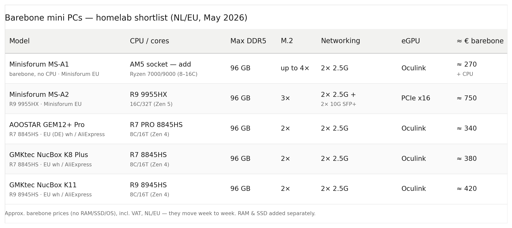

Yes, building any computer in 2026 is a painful experience for your wallet. Unfortunately, it won't get better any time soon (thanks, AI!), and it might even get worse, so we just have to grit our teeth and try to find the best deals possible.

As I mentioned in the previous part of this series, a homelab is an indispensable tool for improving your engineering skills, which is why I think it's a worthy investment in your future. But what actually is a homelab?

The answer to this question will be different depending on who you ask. For some, it's just an old laptop lying in a closet. For others, it can be a full-size server rack packed with all kinds of computers and networking gear. Both are completely valid, and I think it boils down to what your goal is. If you want to set up a hypervisor and deploy a few containers or VMs, an old laptop is perfect. If you want to run multiple production-grade K8s clusters and do some experiments, an old laptop won't cut it.

To determine what hardware you need for your homelab, it's important to first set your goals and requirements. Finding the right hardware can be tricky, especially if you're on a budget and don't want to buy everything new. It's good to create a few different options and mark their strengths and weaknesses, so then, when you hunt for deals on eBay, Craigslist, or Facebook Marketplace, you have some flexibility.

To show you what this process looks like in real life, I will share exactly how I did it. I have a few goals, some non-negotiable and some nice-to-haves. Let's start with the non-negotiables.

The foundation of the whole setup is Proxmox. I want to build a single highly available Proxmox cluster, and that alone covers a big chunk of what I'm after - hands-on experience with on-prem virtualization, clustering, live migration, and failover.

On top of Proxmox sits goal number one: running one or more highly available Kubernetes clusters, mostly using Talos Linux, but I want to experiment with other distributions too. These clusters need enough resources to host the tools I actually care about: GitOps (ArgoCD / Flux), observability (Prometheus / Loki / Thanos / Grafana), S3-compatible storage (MinIO / Garage), identity providers (Authentik / Keycloak), a container registry (Harbor), and plenty more. The nice thing is this gives me HA at two layers - the Proxmox cluster underneath, and the Kubernetes control plane and workloads on top.

The next goal is OpenStack. I want to get a feel for it both ways: virtualized as VMs on the Proxmox cluster, and running bare-metal directly on the mini PCs, since each approach teaches something different about how an on-prem cloud is actually built and operated.

My last non-negotiable is experimenting with a properly air-gapped environment - no internet access, mirrored registries and repos, the whole shebang.

Running through all of this is a broader goal: getting genuinely better at on-prem infrastructure, and in particular, leveling up my networking. Wiring together Proxmox, multiple K8s clusters, OpenStack, and an air-gapped segment forces me to actually understand VLANs, routing, and segmentation rather than hand-wave them.

I also have some nice-to-haves. One is the possibility to plug in an external GPU for local AI on Kubernetes, and the other is the possibility of running a Ceph cluster.

When it comes to requirements for the actual homelab hardware, it should be compact, not occupy a lot of space, draw as little energy as possible, be relatively quiet, future-proof, and offer the best value per price ratio. These goals and requirements are quite tough, and it's not going to be easy to build for cheap, but I like a good challenge.

With the goals and requirements set, the next thing I did was prepare the minimum specifications for the homelab PCs. My requirements completely ruled out servers and desktop builds because of the compactness, quietness, and low power draw. That leaves us with pretty much the only option, which is mini PCs, like Asus NUC, Lenovo Tiny, and others.

Regarding the Kubernetes cluster(s) goal, in the past, I already tried running most of the tools I mentioned on a single mini PC with 8 physical cores and 64GB DDR5 RAM. Back then, the CPU was the main bottleneck. There are very few mini PCs that would have a considerably better CPU than what I had, and these tend to be extremely expensive. The only logical option is to spread the resources among multiple mini PCs, which also gives us High Availability as a nice bonus.

The rest of the goals all come down to the resource requirements. Running Ceph, OpenStack, and K8s cluster(s) will require a significant amount of resources. However, I don't need to have everything running all at once, so for the resource requirements of a single mini PC, I aim for a CPU with a minimum of 8 physical cores, min. 64GB DDR5 RAM capacity, and at least two M.2 SSD slots.

For the nice-to-haves, it would be nice to have two 2.5Gbps Ethernet ports, so I can dedicate one port for storage / Ceph traffic, and keep the other for workload network. And it would also be nice if the mini PCs had an OCuLink port, so I could plug in an external GPU.

Before doing deep research and trying to find the best options myself, I plug all that information into Claude, and ask for a table showing multiple mini PC options, all the requirements they match/don't match, and how much they cost. It's important to mention what country you are buying the hardware in, if you want to buy everything new or used, and whether you are open to buying less-known Chinese brands on sites like Aliexpress, because the results will wildly differ based on where in the world you are.

In my case, I mentioned I'm living in the Netherlands, I am open to both used and new PCs, and don't mind less-known Chinese brands from Aliexpress, but only if they ship from the EU, so there are no import duties. I also mentioned that I want a barebone option because the included RAM and storage are usually overpriced and low quality. This is the output I got:

On most of these options, pricing was unfortunately quite off. The AOOSTAR was looking good, but in reality cost 500 EUR, so the best option seemed to be GMKtec K8, which was priced accurately. However, buying it 3 times would cost 1140€, and that is before the most expensive part of this purchase - RAM and storage, so I decided to do the research myself, and try to find something better.

After a few days of scouring the internet, I settled down on 2 options. One option was GMKtec K12, a newer version of GMKtec K8 and K11, which matched all requirements but cost around 345€, which was not a big price difference. The other was Chuwi Aubox 8745HS, which I've never heard of before, but the reviews on YouTube looked good, it matched all the requirements, and was 260€ on Aliexpress, shipped from France, so no import duties.

Reassured by the 30-day money-back guarantee, I decided to pull the trigger on this one and ordered 3 pieces. It arrived without any issues, and I will test them and share my findings in the next part of this series. I mentioned that I am open to used hardware as well, but because of my very specific requirements, and the already very low price of the Chuwi mini PC, it did not make sense to buy used.

Where buying used made sense was the RAM and SSDs. If you are reading this in 2026, you probably know that the prices of these components are absolutely insane. To put this into perspective, for this build, I want to start with 3x 32GB DDR5 RAM sticks and 3x 512GB M.2 SSDs, with a plan of adding 3 more 32GB sticks and 3 more 1TB SSDs later. If I were to decide to buy it new, it would cost me eye-watering 915€ for the three RAM sticks, and 300€ for the three 0.5TB SSDs. One year ago, this would have been about half the price.

Because of that, I decided to watch Marktplaats (the Dutch version of eBay) like a hawk for a few weeks, and I managed to get the 3 RAM sticks for 470 EUR and 3 0.5TB SSDs for 140 EUR. **The total cost of buying the 3 mini PCs with a total of 96GB DDR5 RAM and 1.5TB SSD storage was 1390€ incl. shipping.**

With this, I got almost everything I need to start building, but I decided to go with a few extras. One thing that's almost a non-negotiable is a networking switch. Each mini PC has 2 ports supporting a speed of up to 2.5Gbps. There are switches you can get very cheap but most of them are only 1Gbps, which would most likely be fine for my use case, but I didn't want to risk it, so I decided to go for an 8-port version of Ubiquiti Flex 2.5G, which I managed to find used for 130€. Other, cheaper alternatives also support 2.5Gbps speeds and have 8 ports, but I decided to go with this one because of its clean UniFi interface, the USB-C power option, and the room to grow it gives me down the line.

The other few things I got were a 10-inch Tecmojo server rack, extra shelf, rack power strip, and 12 pieces of 0.3m Cat6a patch cables. I bought all that new on Amazon for about 170€, to make the whole homelab portable.

There are more things I would like to add in the future, like a separate router that supports OpenWRT or Opnsense, UPS for when the power goes down, and also the RAM and storage, as I already mentioned, but for now, I have everything I need to get started.

All the components are currently lying on my table, untouched, because I set writing this blog post as a prerequisite to start building the homelab; otherwise, it would probably be quite difficult to stop playing with the homelab and start writing, so with this out of the way, let's make this pile of components into a homelab. Wish me luck, and see you in the next part, where I will share my experience with using the strangely named mini PC as the core of my homelab!

The parts used in this build:

- Chuwi Aubox 8745HS mini PC - [https://nl.aliexpress.com/item/1005011939017420.html](https://nl.aliexpress.com/item/1005011939017420.html) + 1x 512GB M.2 SSD and 1x32GB DDR5 SODIMM memory - x3
- Tecmojo 10" Desktop Mini Rack - [https://www.amazon.nl/-/en/dp/B0GDNP6WX6](https://www.amazon.nl/-/en/dp/B0GDNP6WX6)
- Extra shelf - [https://www.amazon.nl/dp/B0GDP5JP1G](https://www.amazon.nl/dp/B0GDP5JP1G) (1U version) - I used the 0.5U version but I think the 1U version would fit better
- Ubiquiti Switch Flex 2.5G 8-port - [https://eu.store.ui.com/eu/en/products/usw-flex-2-5g-8](https://eu.store.ui.com/eu/en/products/usw-flex-2-5g-8)
- Cat6a patch cables - 6 pieces - 0.3m - [https://www.amazon.nl/gp/product/B0DTYK6168](https://www.amazon.nl/gp/product/B0DTYK6168)
- DIGITUS DN-95418-FR - 4-socket server rack power strip (not in the picture) - [https://www.amazon.nl/dp/B0BDMBYFJD](https://www.amazon.nl/dp/B0BDMBYFJD)
