In the previous part of this blog series, I shared what approach I chose when deciding on what hardware my homelab needs, and I also went over all the parts I ended up buying. Now is the time to finally start building and turn the pile of parts into a homelab.

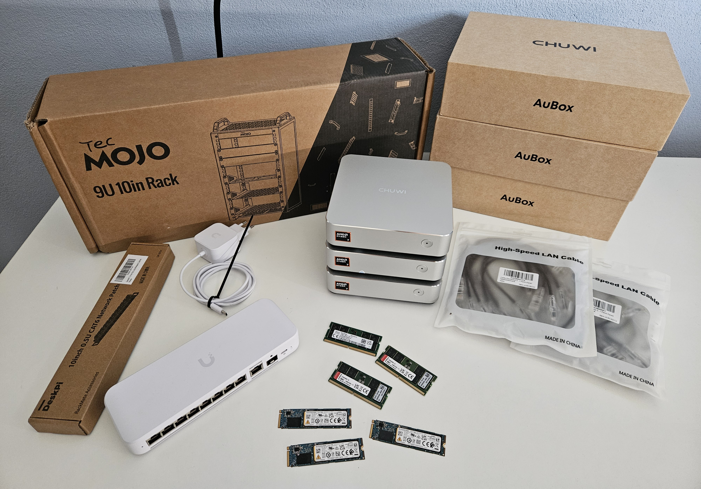

The parts used in this build (details about prices are in the previous part of this series):

- Chuwi Aubox 8745HS mini PC - [https://nl.aliexpress.com/item/1005011939017420.html](https://nl.aliexpress.com/item/1005011939017420.html) + 1x 512GB M.2 SSD and 1x32GB DDR5 SODIMM memory - x3
- Tecmojo 10" Desktop Mini Rack - [https://www.amazon.nl/-/en/dp/B0GDNP6WX6](https://www.amazon.nl/-/en/dp/B0GDNP6WX6)
- Extra shelf - [https://www.amazon.nl/dp/B0GDP5JP1G](https://www.amazon.nl/dp/B0GDP5JP1G) (1U version) - I used the 0.5U version but I think the 1U version would fit better
- Ubiquiti Switch Flex 2.5G 8-port - [https://eu.store.ui.com/eu/en/products/usw-flex-2-5g-8](https://eu.store.ui.com/eu/en/products/usw-flex-2-5g-8)
- Cat6a patch cables - 6 pieces - 0.3m - [https://www.amazon.nl/gp/product/B0DTYK6168](https://www.amazon.nl/gp/product/B0DTYK6168)
- DIGITUS DN-95418-FR - 4-socket server rack power strip (not in the picture) - [https://www.amazon.nl/dp/B0BDMBYFJD](https://www.amazon.nl/dp/B0BDMBYFJD)

The first thing I need to do is assemble the server rack. I chose a small 10-inch desktop rack from a company called TecMojo, which I found on Amazon. There are 3 different heights available. I went with 9U, which is the middle one, and it's perfect for this project + some upgrades in the future.

Putting the rack together was dead simple, all you need to do is connect the sides with 2 top parts and one bottom part, then screw in the laminate top, together with the handles, and you are done. The overall quality is very good.

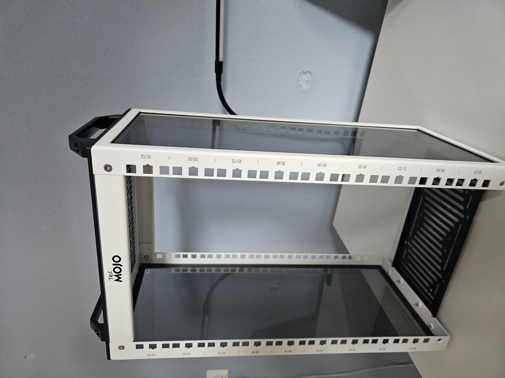

With the rack standing, the next step is to decide where to place the switch and the mini PCs, and mount the included shelves. There is one small one, which is normally used to mount Raspberry Pis, or two 2.5-inch drives. I don't plan to use any of that, so I decided to use it for the switch, which is about 1-2 mm too wide, but after applying some raw power, it fits well enough.

When I was planning this build, I envisioned that the switch would be on the top shelf, and I would put a patch panel in the slot under it, connect all ports with short patch cables, and then route the cables from the opposite end of the patch panel to the mini PCs. Here is an AI-generated image for illustration:

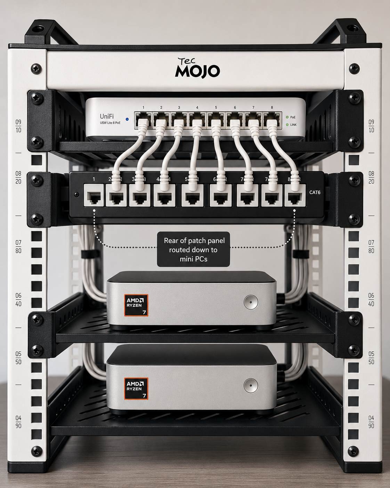

But I hadn't realize that this switch has a USB-C port located at the front, which is kind of awkward because I would have to route the power cable from the back and connect it at a sharp angle. Because of that, I decided to just flip the switch backwards and route the ethernet cables directly to the mini PCs, which makes the front of the rack look much cleaner, and I can return the patch panel with the extra cables and save some money.

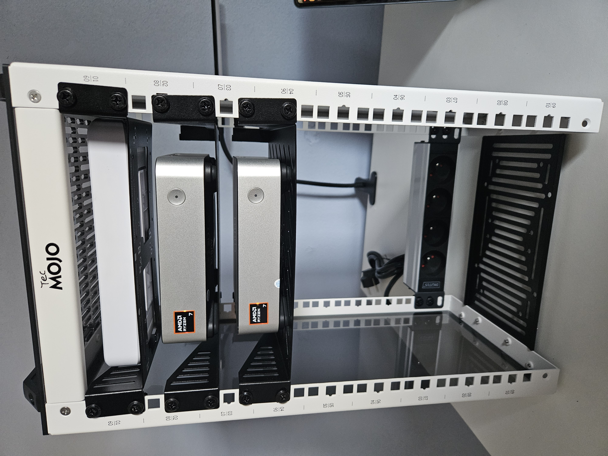

The mini PCs are fairly low-profile, so I didn't have to leave the extra space in between the shelves, but I decided to do so for better airflow.

With the shelves installed, there is one extra thing that I ordered but wasn't sure if it would even fit, and that is the server rack power strip. The reason why I really wanted it is that both the switch and all the mini PCs can be powered by USB-C, so I could get two or three power bricks with USB-C ports, and USB-C cables that are just long enough to reach everything. Thanks to that, I would have almost no excess cables, everything would be stored neatly in the rack, and I could power the whole rack with one power cable. And I am happy to report that the power strip fits perfectly!

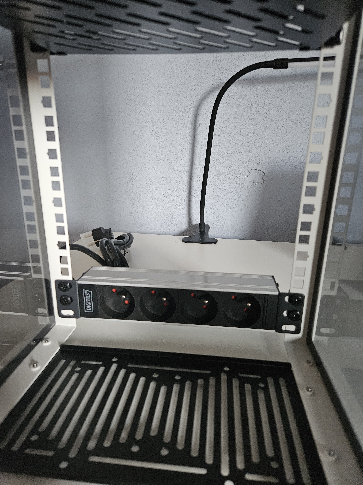

However, the USB-C power delivery solution has a few caveats. The first being that each mini PC can draw up to 114W under full load, so I would ideally need a charger that can do 120-140W per port, and the few chargers that can do that are very expensive.

The second caveat is that I've also seen mentions online saying these chargers are not always as reliable as the standard power brick, and there can be very short power cut-offs, which is fine for smartphones or laptops, but not for mini PCs.

My main concern with the supplied power bricks is that if I were to try to store them inside the rack together with the cables, it might become very cluttered. The bricks are not that huge, but the main issue could be the power cord, since it's quite long. I could theoretically replace that with a shorter one, which might help. I spent some time trying to find the best way to place all the power bricks inside the rack, and the best I could do was this:

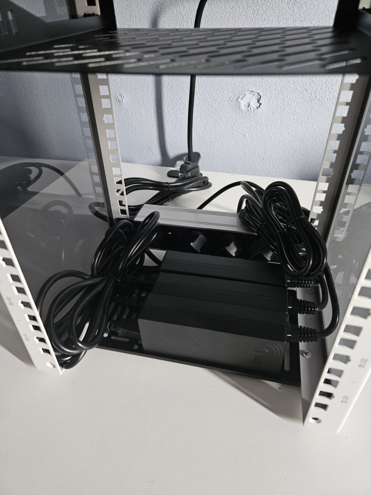

Which is better than I expected, but I wasn't satisfied, so I decided to order short, 0.3m power cables to get rid of the excess cables on the left. With the short cables, I would say that it now looks much better:

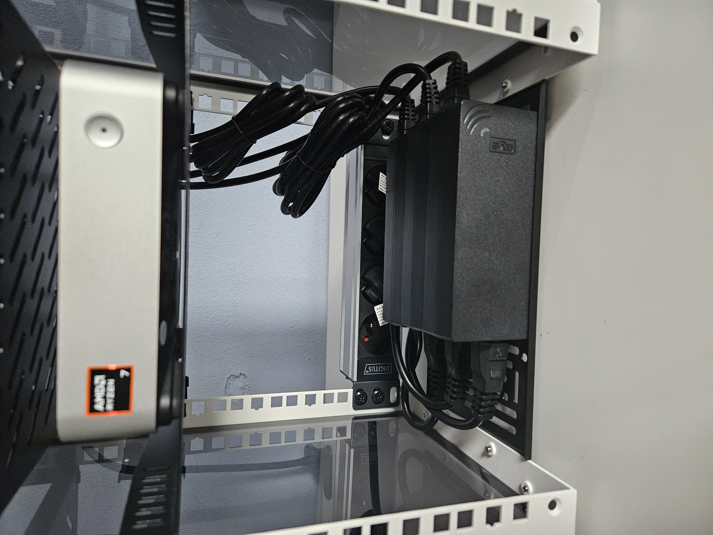

The next step is to insert the RAM modules and the SSDs into all three mini PCs. This is, once again, very simple, just undo 4 Philips screws and place the RAM and SSD into the slot.

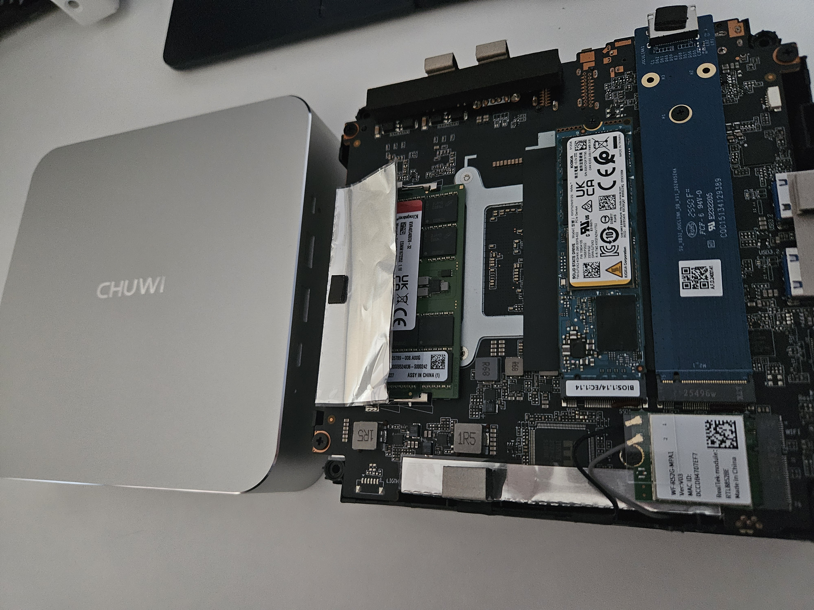

With that out of the way, it's time to set up the virtualization layer. In the previous post, I mentioned that I plan to experiment with OpenStack. The ideal way to do this would be to deploy a Linux OS, such as Debian, on each PC and then install OpenStack directly on top of it.

While I definitely plan to try that approach, I'll start with Proxmox first. I already have Terraform code prepared for spawning VMs and other resources needed for the Talos Kubernetes cluster, which will allow me to test the mini PCs under load and determine whether they are suitable for my use case.

Proxmox is also a great starting point because it gives me flexibility. I can deploy OpenStack inside Proxmox VMs, or potentially even deploy OpenStack on Kubernetes. Both options involve nested virtualization, which adds some overhead and complexity, but for an initial lab environment, it is a useful trade-off, as it allows me to experiment, rebuild quickly, and validate the hardware before committing to a more bare-metal OpenStack deployment.

I will not be going over the Proxmox installation process because it is very simple. All I had to do was download the Proxmox ISO, create a bootable USB drive, plug it into each mini PC, and go through the installation steps. There are a ton of guides available in case you are interested in learning more.

With everything closed up and wires connected, this is how the homelab looks in the front:

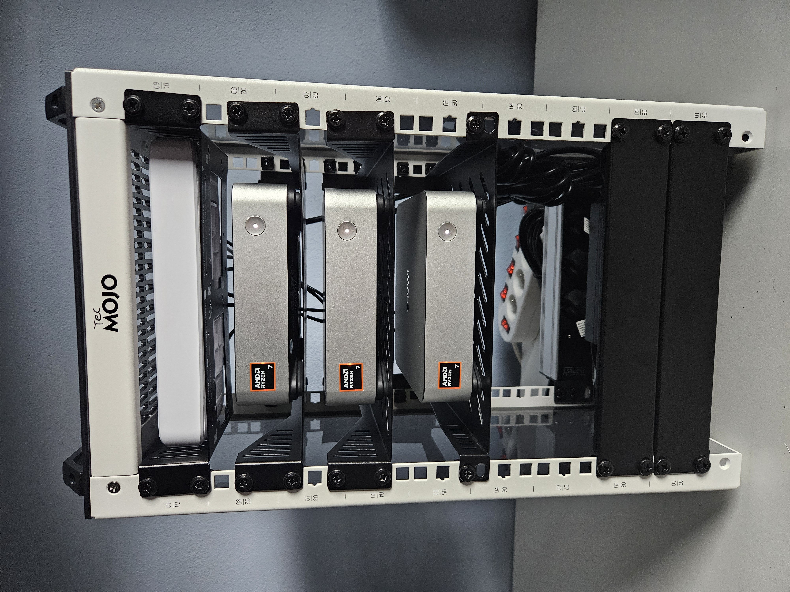

And this is how it looks from the back, where all the cables live:

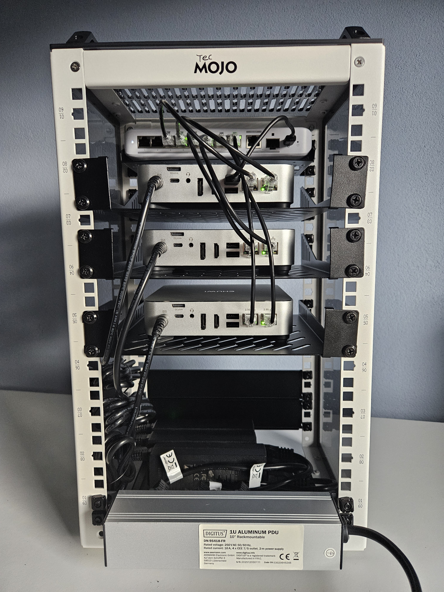

Overall, I think there are improvements I can make, but for the initial setup, I am really satisfied with the result. A big goal for me was that the whole thing should be easily movable and have as few cables as possible, because I will soon be moving to Sweden, and with this setup, all I have to do is plug in one power cable and the ethernet cable in case I need internet access.

I was so happy with the result, that I decided to try to place it to our living room, as a nice "little" decoration:

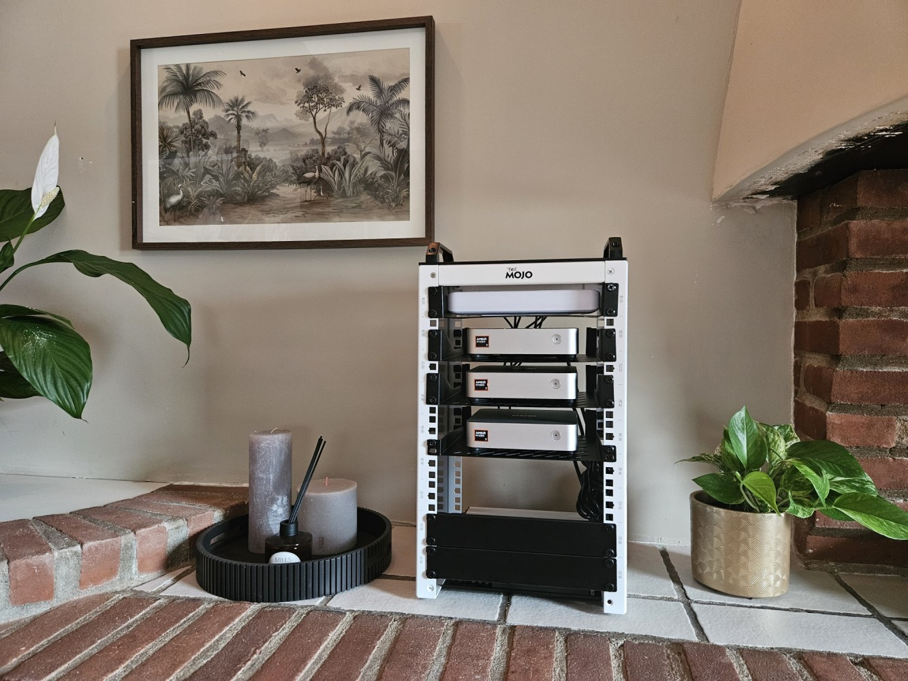

but my fiancee was NOT so enthusiastic about this idea so it will probably live in our closet...

Anyway, that's it for now. I do not have an exact plan for the next part of this series yet, but it will most likely be about setting up the network, creating the Proxmox cluster, deploying the Talos Kubernetes cluster, reviewing the temperatures and noise levels of these mini PCs under load, and deciding whether they were a great choice or a big mistake.

Thank you for making it this far, and see you in the next one!
